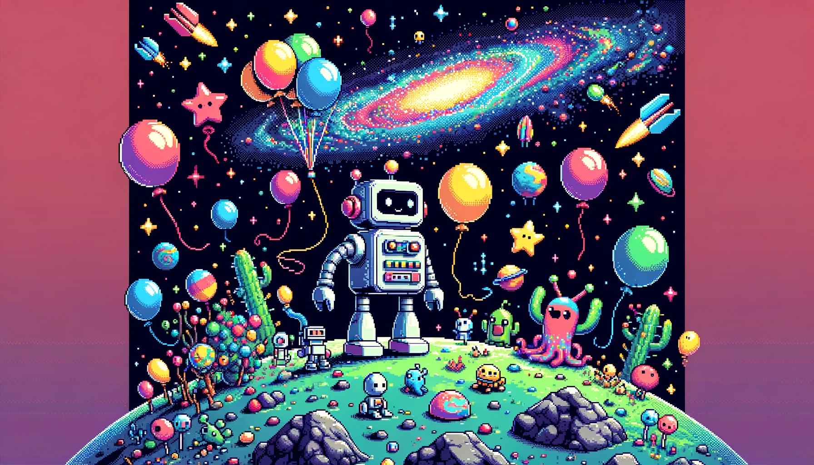

Background is generated by [DALL·E]

(https://www.youtube.com/@amasalov) &nbsp;
) &nbsp;

 &nbsp;

- 🔭 I’m currently working at [Clover](https://www.linkedin.com/company/clovercollab/mycompany/) where we are building [AI-Driven Collaboration Platform](https://clovercollab.com/).
- 🌱 I’m passionate about [Azure Cloud](https://azure.microsoft.com/en-us), [Microservices architecture](https://microservices.io/) and [LLMs](https://en.wikipedia.org/wiki/Large_language_model).
- 📝 I’m aiming to record **one YouTube video per week** starting from March 2024.
- ⚡ Fun fact: I read books, ride bicycles, and practice kickboxing!

## 💡 A Quote:

## 💻 My Tech Stack:

## 📖 Read My Blogs:

    &nbsp;&nbsp;
    &nbsp;&nbsp;
    &nbsp;&nbsp;

